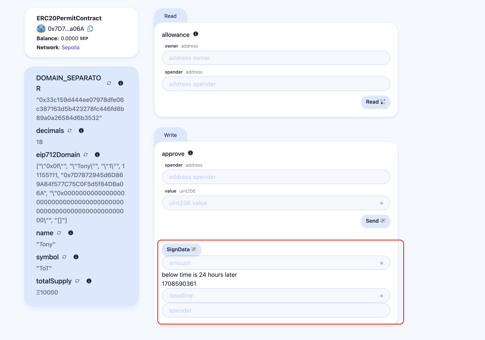

# 🏗 This project based on [Scaffold-ETH 2](<README(Scaffold-ETH-2).md>)

## Online-website

- [signatureTest](https://eip-712-try-by-scaffold-eth-2-nextjs.vercel.app/signatureTest)

## Change points

1. Delployed contract [ERC20PermitContract](packages/hardhat/contracts/ERC20PermitContract.sol) in sepolia net work
   - [add signatureTest component](packages/nextjs/app/signatureTest)
   * [EIP721 signature core code](https://github.com/sodexx7/EIP712_TRY_BY_SCAFFOLD-ETH_2/blob/main/packages/nextjs/app/signatureTest/_components/contract/SignDataTest.tsx)
2. Add one page [signatureTest](https://eip-712-try-by-scaffold-eth-2-nextjs.vercel.app/signatureTest), which can allows the token's user to permit one address to use its tokens.

- 

* **_verify result can use function allowance_**

## Other info

- For now, address 0xaf9cC770475a9A36184124f3ECC023Eb9ee80D2e, has 10000 token. if want to test more cases can get token from this address.

- deploed website by https://vercel.com/

  - should set YARN_ENABLE_IMMUTABLE_INSTALLS=false in the Vercel/system env config As [yarn lock file problem](https://github.com/renovatebot/renovate/discussions/9481?sort=old#discussioncomment-798291)

- add ethers@5.4.6, for using ethers.utils.splitSignature

## TODO check

- current using eth_signTypedData_v4, only show message, not including domain info
